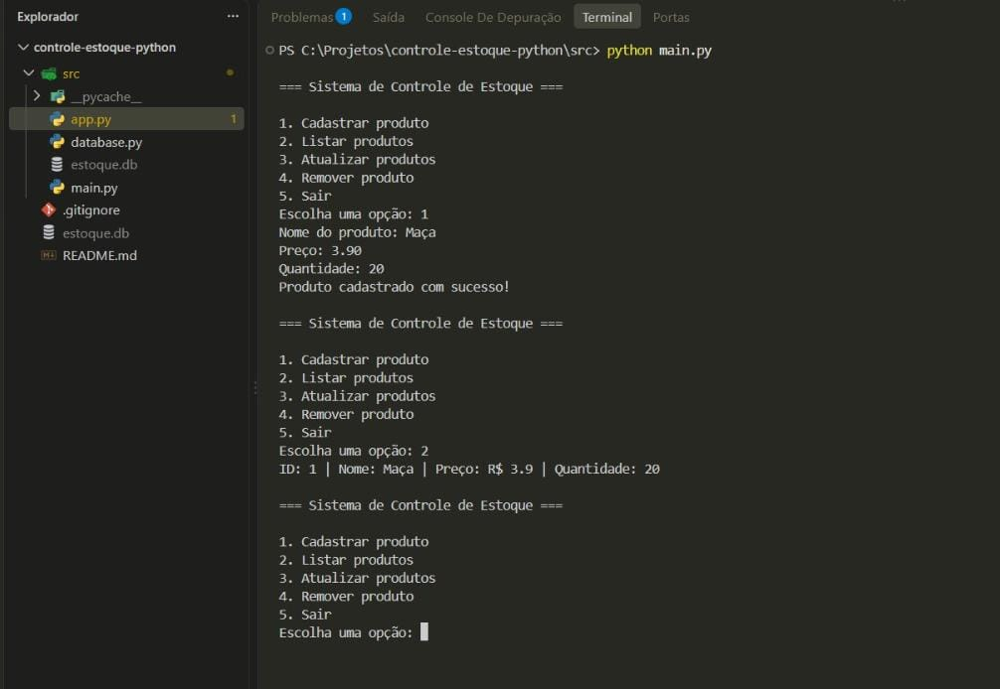
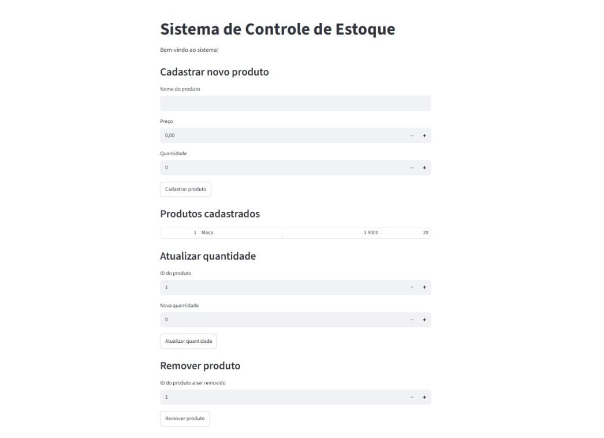
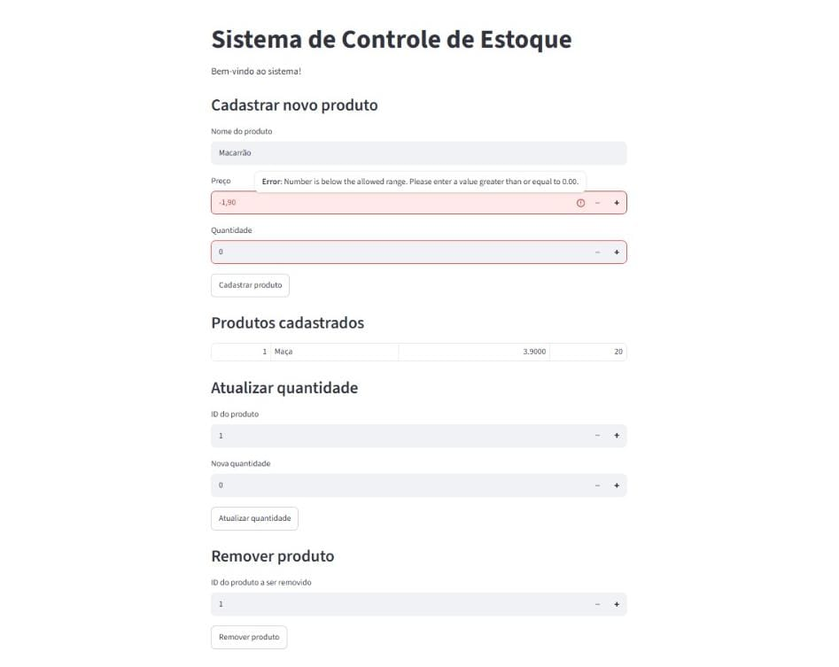

# 📦 Sistema de Controle de Estoque

Sistema de gestão de estoque desenvolvido em Python, com persistência em banco de dados SQLite. Permite cadastrar, listar, atualizar e remover produtos, com validação de dados e tratamento de erros. Disponível em duas interfaces: linha de comando (terminal) e interface visual web (Streamlit).

🔗 **[Acesse a demonstração ao vivo](https://controle-estoque-meynka.streamlit.app)**

## 🖥️ Demonstração

### Interface via terminal (CLI)
Menu interativo para gerenciar o estoque diretamente pelo terminal:



### Interface visual (Streamlit)
Versão web do sistema, rodando localmente no navegador:



### Validação de dados em ação
O sistema impede o cadastro de valores inválidos (como preços negativos), tanto na interface visual quanto no terminal:



## ⚙️ Funcionalidades

- **Cadastrar produto**: nome, preço e quantidade, com validação de dados
- **Listar produtos**: visualização de todos os produtos cadastrados
- **Atualizar quantidade**: ajuste de estoque por ID do produto
- **Remover produto**: exclusão de produtos por ID
- **Validação de dados**: impede preços negativos, quantidades inválidas e campos vazios
- **Tratamento de erros**: mensagens claras sem travar o sistema, mesmo com entradas inválidas

## 🛠️ Tecnologias utilizadas

- **Python 3** — linguagem principal
- **SQLite** — banco de dados local, via módulo `sqlite3`
- **Streamlit** — interface visual web
- **Git/GitHub** — controle de versão

## 📁 Estrutura do projeto

```
controle-estoque-python/
├── src/
│   ├── database.py    # Lógica de acesso ao banco de dados (CRUD)
│   ├── main.py         # Interface via terminal (CLI)
│   ├── app.py          # Interface visual (Streamlit)
│   └── estoque.db      # Banco de dados (gerado automaticamente, não versionado)
├── .gitignore
└── README.md
```

## 🚀 Como rodar o projeto

### Pré-requisitos
- Python 3.10 ou superior instalado

### Passo a passo

1. Clone o repositório:
```bash
git clone https://github.com/meynkadev/controle-estoque-python.git
cd controle-estoque-python/src
```

2. Instale as dependências:
```bash
pip install streamlit
```

3. Para rodar a versão de terminal:
```bash
python main.py
```

4. Para rodar a versão visual (Streamlit):
```bash
streamlit run app.py
```
O navegador abrirá automaticamente em `http://localhost:8501`.

## 💡 Decisões técnicas e aprendizados

- O código foi organizado seguindo o princípio de **separação de responsabilidades**: `database.py` cuida exclusivamente da lógica de dados, enquanto `main.py` e `app.py` são interfaces diferentes que consomem essa mesma lógica sem duplicação de código.
- Uso de **parâmetros SQL (`?`)** em todas as queries, prevenindo vulnerabilidades de SQL Injection.
- Validações de negócio (preço > 0, quantidade ≥ 0) implementadas na camada de dados, garantindo que sejam respeitadas independentemente da interface usada.
- Optei pelo **Streamlit** para a interface visual pela agilidade de prototipação e por ser uma ferramenta amplamente utilizada atualmente em contextos de dados e ferramentas de IA — mesmo sabendo que sistemas de PDV/automação comercial no mercado normalmente utilizam aplicações desktop dedicadas.

## 👤 Autor

Desenvolvido por Meynkâ Griebeler como parte de um projeto de estudo em Python, com foco em fundamentos de backend, banco de dados e boas práticas de desenvolvimento.